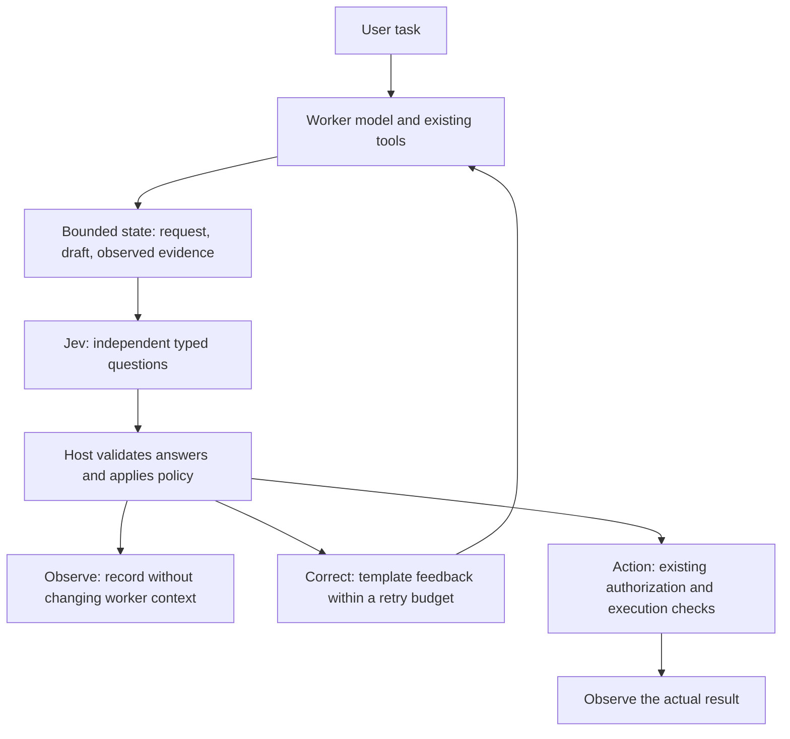

# Jev in pipelines and agents — KISA's field notes

**Evidence cut: September 18, 2026.** This guide draws on 12 recently active,
distinct top-level Codex sessions, excluding approval-review subagents and
duplicate rollouts. Five contained substantive Jev requests or results. Relevant
implementation files were also inspected in the Pi extensions, Hermes browser
guard and LocalForgeLLM integration. Private transcripts and configuration are
not part of this public item.

The practical pattern is an ordinary model doing the work, a separate service
making narrow judgments, and host code deciding what those judgments change.
Use `jev` for connection details and `jev-integration` for the learning route.

## What Jev actually contributes

Jev is TypeSafe AI's first System One model: supply a state and constrained
questions, receive structured decisions. TypeSafe describes parallel evaluation
and training for calibrated decisions through RLCD. Jev does not compose free
text, review comments or executable code. It can select a predefined reason
or action, or assess a criterion.
[Introduction](https://docs.typesafe.ai/introduction),
[launch explanation](https://typesafe.ai/blog/introducing-system-one-models-and-jev)

The advertised type guarantee constrains the answer's structure and available
values. **A valid choice can still be the wrong choice.** It does not establish
that a source is true, a task is complete or an action is authorized. The
provider documents weaknesses in arithmetic, dates, indirect questions,
irrelevant context and adversarial input. Keep exact computations and access
control in code; validate semantic quality on your workload.
[Known limitations](https://docs.typesafe.ai/model-jaggedness/jev-1.13)

| Primitive | Good question in our stack | Interpretation |
|---|---|---|
| Choice | Which available research tool fits this task? | One allowed option, its distribution and confidence; provide an escape option for uncovered cases |
| Noul | Do observed tool results support this completion claim? | Probability of yes; near 0.5 is uncertain, not a medium quality grade |
| Score | How much of the requested comparison is covered? | Position on an ordered descriptive rubric, plus distribution, legend and confidence |

Choice supports up to 255 options; Score uses 2–10 ordered levels. With three
levels, Score runs from 0 to 2, not automatically from 0 to 1. Normalize by
`len(criteria) - 1` before combining differently sized rubrics. Do not use a
Score as an exact measurement or an invented numeric extraction.
[Choice](https://docs.typesafe.ai/primitives/choice),
[Noul](https://docs.typesafe.ai/primitives/noul),
[Score](https://docs.typesafe.ai/primitives/score)

`confidence` summarizes the shape of a Choice/Score distribution. It is not
the probability of a named event and does not certify correctness. A
Noul's `noul` and a Choice's `probabilities[option]` answer different questions
from `confidence`. Calibrate thresholds against the exact primitive and rubric;
do not copy a threshold between them.
[Confidence](https://docs.typesafe.ai/confidence)

## Where KISA actually used it

These are case observations, with their verification limits. Installing an
adapter, getting an API response and completing a browser task are distinct
outcomes.

| Case in the September 16–18 work | Implementation or session evidence | Reusable lesson |
|---|---|---|
| Pi + Ornith: independent answer grading | Manual `/jev` evaluates relevance, completeness and evidence from the request, final answer and tool results. Scores are stored outside the model's conversational context. The session recorded a real API check. | Keep the evaluator separate from the worker and its task. |
| Pi: research supervision | `jev-research` checks the research policy, tool choice, coverage, sources, citations and usage; modes are `observe`, `correct`, `off`, with at most two final-answer correction rounds. The session recorded a live research/evaluation cycle and unresolved findings after correction. | Bounded feedback can expose omissions without promising that every correction succeeds. |
| Pi: browser-use | Host adapter based on `browser-use/jev-ultrafast`; Jev chooses operations/targets, the local model writes field values. Limits include 12 default steps, 24 maximum, 240 seconds and one browser job at a time. | Separate observation, decision, text generation, execution and outcome verification. Browser UI success was not established by those installation checks. |
| Hermes: answer verification outage | The owner reported that missing Jev responses blocked replies. The repair session reported a restarted service and preservation of the original answer with “Текст не проверен Jev”. The underlying provider failure was not established. | An optional text-quality check must have an explicit degraded-delivery path. This is a recorded repair, not a fresh remote health check. |
| Hermes: Brave action guard | Pre-tool checks rejected discovery before Brave received a call. The observed `scope=0.81` missed the configured `0.85` threshold; separate DNS, local-model availability and browser-bridge authentication issues also occurred. | A score rejection does not diagnose browser permissions. The final recorded state still did not confirm an opened tab. |
| LocalForgeLLM: Bonsai + llama UI | The integration reused selected Hermes MCP/skills and the existing browser adapter; skill access and local field-text generation were checked. | Tool reuse does not migrate Pi/Hermes lifecycle hooks. A complete Jev-controlled browser run was not verified in that check. |

The public upstream is
[browser-use/jev-ultrafast at the inspected revision](https://github.com/browser-use/jev-ultrafast/tree/452c1ad2dd628008f1d5608f28158d76e49e6cc0).
Our Pi/Hermes adapters are local implementations; cloning an upstream project
does not reproduce those installations.

## The boundary that stopped task drift

One initial setup put “configure Jev” into the worker's persistent instructions
and exposed the TypeSafe builder skill. The local model began treating Jev
setup as its job instead of answering the actual request. The repair removed
that context and made `/jev` a separate observer.

Use three explicit modes:

- **Observe:** evaluate the completed turn and display/store results for the
  operator. Do not insert them into the worker's conversation.
- **Correct:** deliberately send a small, evidence-bound repair message back
  to the worker. Track correction rounds and stop at the configured budget.
- **Off:** preserve the normal agent loop without evaluation calls.

The manual observer and the later research controller are different
components. In the recorded research controller, `correct` is the default;
starting a new integration in `observe` is this guide's recommendation, not a
claim about that installed default.

Jev does not invent an explanation of a failed check. Map criterion IDs to
host-owned feedback templates, for example:

| Criterion below the chosen threshold | Feedback written by the host |
|---|---|
| `evidence` | Open the primary source for the unsupported claim; distinguish inference from observation. |
| `coverage` | Address the remaining explicit requirements or state the unresolved gap. |
| `usage` | Reconcile the report with actual provider request/usage records. |

This is more useful than one pass/fail flag. For a novel explanation of a race
condition or a new patch, use a generative model and actual code/test evidence.

## Put it at one real decision point

Define the state from records the host owns: the original task, current draft,
tool names and arguments, actual results/errors, source URLs and relevant
constraints. Distinguish attempted, blocked, failed and completed actions.
Do not let a worker's self-report replace tool evidence.

Filter to the fields needed by the question. Keep retrieved pages and tool
output as data, distinct from the rubric. Remove secrets before external
evaluation and disclose that a local-model workflow now sends selected data to
a hosted provider. If evidence exceeds the adapter's budget, return an explicit
incomplete/unverified status instead of silently dropping inconvenient results.
[State guidance](https://docs.typesafe.ai/concepts/state)

Batch independent questions about the same state: source sufficiency, required
coverage and appropriate tool can be evaluated together. Answers do not read
each other. For browser work, precompute operation and possible target
questions, then consume only the relevant target. A genuinely dependent next
question requires host logic or a subsequent request. Extra questions still
consume input tokens.
[Speculative fan-out](https://docs.typesafe.ai/patterns/fan-out)

## Transfer the pattern to projects and pipelines

The following are implementation recipes inferred from the cases, not claims
that KISA deployed every example.

| Placement | Jev's bounded job | What ordinary code still owns |
|---|---|---|
| Before an agent chooses a tool | Classify intent among registered capabilities, with `clarify`/`none` | Tool availability, credentials, allowed arguments and permissions |
| Inside a research pipeline | Check tool fit, evidence coverage and citation support | Fetch sources; count requests; retain URLs, dates, failures and usage |
| Before RAG context assembly | Score relevance of already retrieved candidate passages | Retrieval, document access, source freshness and context budget |
| In document triage | Classify a record or choose among parser-extracted candidates | Exact parsing, deduplication, date arithmetic and durable writes |
| In a coding/review workflow | Check explicit requirements against a diff and test results | Run tests, inspect behavior and produce a detailed review or patch |
| Around browser-use | Select one observed operation/element and evaluate the resulting state | Browser binding, fresh element IDs, execution, cancellation and authorization |

Start with one existing branch that currently requires semantic judgment.
Keep the rules in one versioned rubric and put thresholds in host-owned
configuration. Do not replace a working parser, exact comparison or database
constraint with a probabilistic call.

For the recorded research policy, Tavily is the first search/read provider;
Exa is used for failures, coverage gaps or the user's preference. That is a
local workflow choice, not a TypeSafe requirement. Grade against the actual
project policy and do not demand every provider on a one-fact question.

## Browser executor versus browser guard

The browser-use implementation observes page text/elements, asks Jev for an
operation and compatible targets, and calls a separate text model when a field
needs a value. The host validates the result before acting. Our adapter uses
an isolated temporary profile. A `DONE` decision must be checked against the
observed outcome.
[Upstream decision/text split](https://github.com/browser-use/jev-ultrafast/blob/452c1ad2dd628008f1d5608f28158d76e49e6cc0/jev_ultrafast/model.py),
[execution loop](https://github.com/browser-use/jev-ultrafast/blob/452c1ad2dd628008f1d5608f28158d76e49e6cc0/jev_ultrafast/agent.py)

The Hermes guard has a different job: inspect a proposed call to the existing
Brave bridge before the bridge executes it, then check the final report. It
does not itself provide a browser or establish an authenticated connection.

When a call is blocked, record **which layer** stopped it: local policy,
Jev evaluation, DNS/HTTP, local text model, browser authentication or execution.
In the observed incident, the agent invented “Jev scope settings” in the browser
extension. `scope` was actually our Noul criterion, compared with our local
threshold. A subsequent operator-approved threshold change did not resolve the
separate authentication requirement. It is not a recommended universal value.

Reobserve after navigation or a stale target; never apply an old element ID to
a new page. Keep browser task limits and the host's existing action policy.
An isolated profile is not the user's logged-in Brave, and a successful
evaluation is not permission to silently switch between them.

## Failure policy: preserve the answer, preserve action controls

| Condition | Ordinary text-quality review | Tool execution or external side effect |
|---|---|---|
| Evaluation passes | Deliver with the recorded review status | Continue through existing permission checks; verify the result |
| Valid evaluation reports a concern | Show the concern or request a bounded correction | Follow the configured hold/review policy; do not bypass via another tool |
| Timeout, DNS failure, rate limit or invalid response | Preserve the draft with an explicit “not checked by Jev” marker | If this check is a required gate, hold the action and report the unavailable gate |
| State/evidence is incomplete | Mark unverified and explain the missing evidence | Gather missing observations or stop; no synthetic passing score |

Preserving text is limited to an optional quality-review failure; it does not
override the application's other output or privacy controls. A real negative
verdict is not an API outage. If an action already ran, a later review failure
cannot undo it: report its actual state and use the application's normal
recovery path.

Avoid correction loops: bind reviews to a session, turn and response ID;
deduplicate unchanged answers; discard late evaluations after task changes;
cancel outstanding requests on reset. Count correction rounds separately from
HTTP retries. The recorded Pi controller has a two-round final-answer limit.
Never replay a purchase, message or write just to repair the final wording.

## Calibrate and measure before expanding

Use a small labeled set of your own tasks: complete and incomplete answers,
real tool failures, unsupported success claims, ambiguous requests and missing
sources. Add Russian examples if that is the working language. Hold some cases
out while tuning wording and thresholds.

Measure false acceptance, false rejection, unverified rate, correction yield,
p50/p95 added latency, calls and input tokens per **completed task**. Separate
Jev time from text generation, research and browser execution. Tune for the
cost of each kind of error; a high number alone is not a calibration result.

Keep hard requirements separate from a weighted quality score: a good style
score cannot compensate for missing evidence or permission. If combining soft
dimensions, document the weights and normalization in ordinary code.
[Composite scoring](https://docs.typesafe.ai/patterns/composite-scoring)

Before enabling automatic correction or routing, verify the outage path,
malformed responses, stale reviews, deduplication and the retry ceiling.
Acceptance means the original task still finishes, the added checks catch a
useful class of error, and disabling the optional evaluator restores the prior
quality-review flow without widening tool permissions. Keep a rollback switch
and repeat calibration after a model, rubric or tool-contract change.

Related catalog items: `hooks` for lifecycle integration, `tavily` for research,
`agent-internet` for choosing research and browser tools, and `mcp-connection`
for connecting the chosen tools to an agent through MCP.
